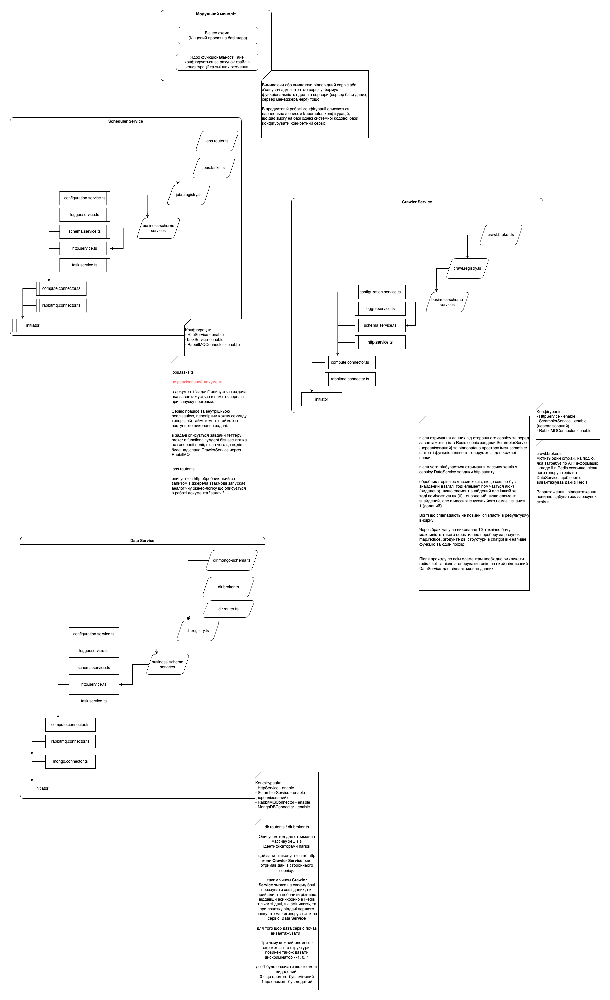

# ofms-ltd-test-task

Через брак часу необхідно було приймати рішення - написати базову предметну логіку взявши готовий Nest.js та витратити
половину часу на написання пари обробників запитів, або написати архітектуру системи, яка б описувала комплекс рішень та
їх дизайн в рамках програми свідомо пропускаючи детальний опис обробника в коді.

Я пішов другим шляхом - оскільки обробник можна описати поетапно, а архітектура розкриє розуміння патернів
проєктування, модульності, а реалізація бізнес-логіки може бути здійснена рядом способів, оскільки ТЗ має люфт під
бізнес-обмеження.

## Загальна архітектура

Система будується на абстрактній системній кодовій базі (ядро) - створення провайдера сесій, сервісу перевірки прав,
сервісу планувальника задач тощо.
Кожна бізнес-схема - кінцева реалізація використовує тільки ті частини ядра - які необхідно для цієї бізнес-схеми, таким
чином прибирається дублювання коду в системній кодовій базі.

Системна кодова база складається - з:

1. ініціатор - запускає життєвий цикл програми.
2. зʼєднувачів - клієнти різних частин програми, які відділяється один від одного мережею.
3. функціональні компоненти - сервіси, провайдери, тунелі - описують функціональність ядра.
4. завантажувач бізнес-схеми та сеттери - завантажують опис бізнес-схеми та відповідають за контрактне програмування -
   описують декларативні правила, як повинна виглядати бізнес-схема.

Бізнес-схема має доступ лише до сеттерів та складається з такої ієрархії:

1. Бізнес сервіси, наприклад сервіс сповіщень, сервіс інтернет-магазину, сервіс менеджера задач тощо.
2. Предметні області, наприклад - задачі, типи задачі, журнал помилково виконаних задач, звітність тощо.
3. Документи - окремий кінцевий елемент, який описує лише один аспект бізнес-логіки предметної області - http маршрути,
   опис схеми бази даних, валідатор тощо.

### Логіка налаштування

Кількість екземплярів та їх робота визначається системою контейнеризації або фізично особою та є інфраструктурним
рішенням. Кожний бізнес-сервіс описує реєструє відповідні домени, які будуть завантажені в ядро.

Описана конфігурація завантажується через сервіс конфігурації, який в системі не реалізований, але може бути аналогічний
цьому - бібліотеку написав рік назад чи більше.

### Ключові аспекти

В рамках тестового завдання керувався наступними ключовими аспектами:

- Відділення системної кодової бази від кодової бази предметної області.
- Використання IoC контейнера для слабкої звʼязанності між елементами програми.
- Реалізація обʼєктно-орієнтовного типу програмування (ядро сервера), та функціонального програмування (бізнес-схема).
- Реалізація Clear Architecture архітектури - де:
    - бізнес-схема на першому рівні змін, яку може вантажити будь-яке ядро обчислень, яке реалізує групу агентів
      функціональності.
    - ядро функціональності - другий рівень змін, яке може бути завантажене на віртуальну машину в контейнер чи фізично
      влаштовано, оскільки ядро обчислень є безстановим, та виносить стани в інші середовища - базу даних, сховище
      файлів, key-value сховища для збіерігання сесій тощо.
    - docker / kubernetes / virtual machine - будь-яке популярне інфраструктурне рішення.
- Впровадження SOLID:
    1. initiator - не залежить ні від чого та лише запускає відповідні зʼєднувачі (connectors).
    2. connectors - відповідає за впровадження зʼєднувачів елементів програми, які взаємодіють по мережі та не залежать
       від компонентів функціональності окрім сервісу логування та сервісу конфігурації, оскільки ці сервіси визначають
       роботу зʼєднувачів. В випадку інших сервісів - використовуються абстрактні інтерфейси.
       3.а. services - залежать один від одного в відповідності до життєвого циклу.
       3.б. tunnels - описують перелік функціональності зʼєднувачів.
    4. agents - агенти функціональності відповідають за надання методів для створення та опису бізнес-схеми.
    5. business-scheme - бізнес-схема, яка складається з сервісів. Кожний сервіс складається з предметних областей,
       кожна
       предметна область з документів предметної області, таким чином створюючи ієрархічну структуру та дозволяє
       впроваджувати EDA (event driven design) DDD (domain driven design)
- Впровадження GRASP - побудова інформаційних експертів, створення слабкого зацеплення між сутностями шляхом інтерфейсів
  та inversion of control та побудова сильного звʼязування за рахунок належності до відного переліку модулів та
  абстрактних класів наслідування.
- Реалізація життєвих циклів - initiator - connectors - services
- Використання Domain Driven design для відділення одних сущностей від інших та вкладанням залежних сутностей від
  незалежних - специфікацій в агрегати. тощо.

Архітектура передбачає можливості розширення на будь-якому рівні абстракцій, а також побудову декомпозицій - замість
написання обробка бізнес-логіки в одному контролерів - створити документи "репозиторій", "валідатор" чи інші, та
здійснити декомпозицію бізнес-логіки на окремі елементи. Окремо, архітектура надає можливості розвивати проєкт великою
командною - за поділом кодової бази - предметна чи система , а також поділом на окремі сервіси.

## Діаграмма бізнес-логіки



## Аргументація обробників запитів

```
Для виконання синхронного запиту мікросервіс виконує HTTP/gRPC/інші запити до іншого мікросервісу та очікує відповідь. Має такі особливості:

Час відповіді мікросервісу не повинен перевищувати 20 секунд
Може передавати до 1 МБ даних
```

Час відповіді можна регулювати за рахунок AbortController, так, в агент функціональності необхідно додати метод, який
формує запит, та в опцій додати^

- поле "timeout", за замовчуванням зробити його 20, та передавати це в опцію запиту - timeout.
- поле "maxSize" за замовчуванням 1 (в самому методі request сервісу HttpService вже вираховувати калькуляцію - 1024 *
  1024), та передавати це кінцеве значення в опції запиту - maxContentLength

```
Для виконання асинхронного повідомлення мікросервіс відправляє повідомлення до іншого мікросервісу та не очікує відповідь. Як правило, для цього використовуються черги повідомлень, такі як RabbitMQ, SQS та інші. Має такі особливості:

Може передавати до 200 КБ даних у повідомленні
Повідомлення отримуються у задовільному порядку
Повідомлення мають встановлений вами задовільний період життя
```

В системі використовується RabbitMQ який підтримує з коробки всі ці рішення, так при описі брокера повідомлень, ми можем
для кожного слухача створити ряд опцій, аналогічно до того, як зараз вказується версія, чи тип комунікації.

Такими опціями можуть бути:

- Може передавати до 200 КБ даних у повідомленні

```typescript
const connection = await amqp.connect('amqp://localhost');
const channel = await connection.createChannel();
const queue = 'my_queue';

await channel.assertQueue(queue, {
    durable: true,
});

const data = {
    message: 'This is a message',
    timestamp: Date.now()
};

const message = JSON.stringify(data);

if (Buffer.byteLength(message) <= 200 * 1024) {
    channel.sendToQueue(queue, Buffer.from(message), {persistent: true});
    console.log('Message sent:', message);
} else {
    console.error('Message exceeds size limit of 200KB.');
}
```

- Час життя

```typescript
await channel.assertQueue(queue, {
    durable: true,
    arguments: {
        'x-message-ttl': 60000 // встановлюємо TTL у мілісекундах
    }
});
  ``` 

- Відвантаження у задовільному порядку відбувається в RabbitMQ і так, оскільки принцип черги це FIFO - перший зайшов, перший вийшов.

Аналогічно з опціями HTTP ряд значень можем вказати за замовчування, інші як опції які передаються в описі обробника,
які поітм завантажаться бізнес-схемою, та будуть оброблені в RabbitMQ зʼєднувачі при надходженні топіку


